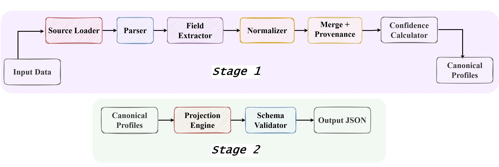
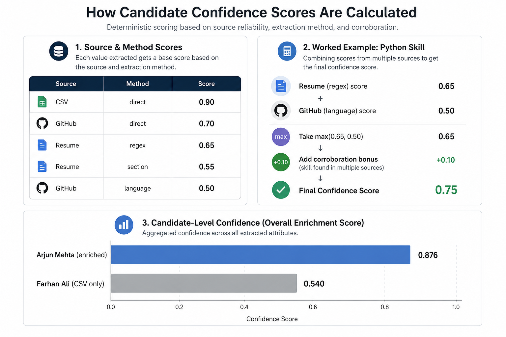
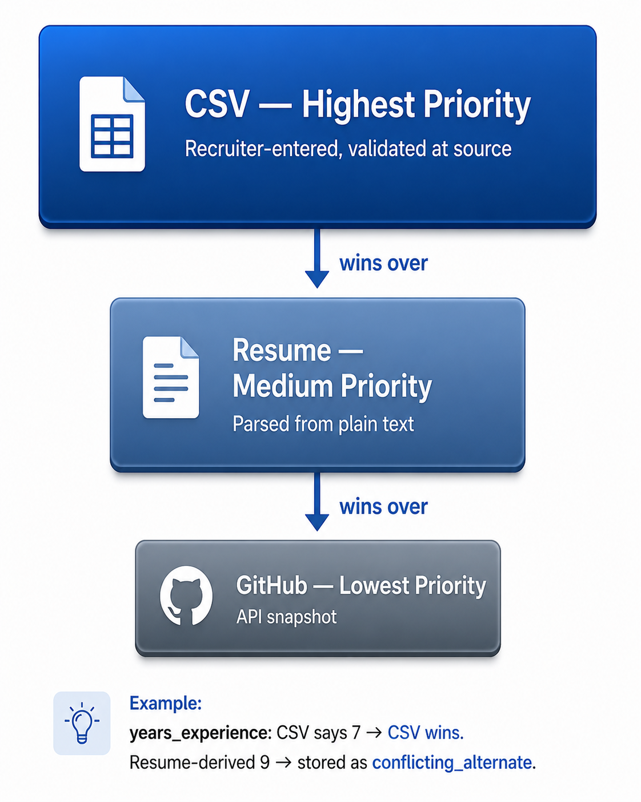
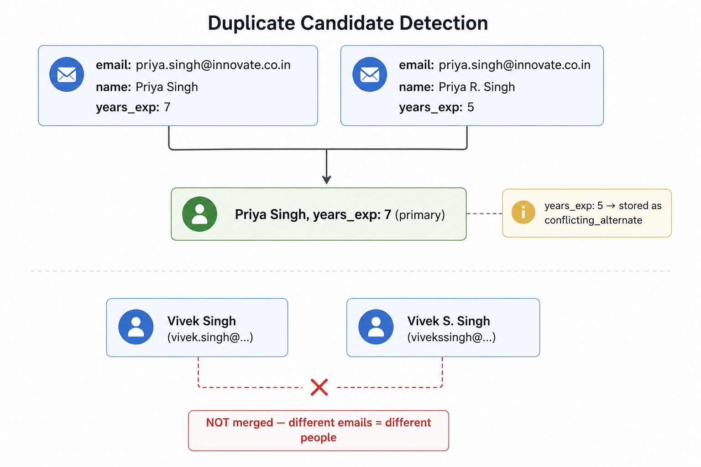

# Multi-Source Candidate Data Transformer

This project takes candidate data coming from three different sources — a recruiter's CSV spreadsheet, plain-text resumes, and GitHub profile JSON snapshots — and turns all of it into clean, structured, confidence-scored candidate profiles. The pipeline has two stages: Stage 1 builds one canonical profile per candidate by merging everything together, and Stage 2 reshapes that profile into whatever format a downstream system needs.

The main challenges this solves are: the same person might show up in multiple rows (duplicates), different sources might disagree on the same field (conflicts), and you need to know *why* any given value ended up in the final output (provenance). The pipeline handles all three.

---

## Pipeline Diagram



---

## How to Run

```bash
# 1. Install dependencies
pip install -r requirements.txt

# 2. Stage 1 — build canonical profiles
python orchestrator.py --stage stage1

# 3. Stage 2 — reshape to a specific output format
python orchestrator.py --stage stage2 --config configs/default_full.json

# 4. Run both stages together
python orchestrator.py --stage all --config configs/default_full.json
```

To generate all five Stage 2 output formats:

```bash
python orchestrator.py --stage stage2 --config configs/default_full.json
python orchestrator.py --stage stage2 --config configs/minimal_ats.json
python orchestrator.py --stage stage2 --config configs/display_export.json
python orchestrator.py --stage stage2 --config configs/strict_required_linkedin.json
python orchestrator.py --stage stage2 --config configs/optional_strict_on_missing_error.json
```

---

## Assumptions

1. Resume files are named `{name}_resume.txt` where `name` matches the `name` column in the CSV exactly (case-sensitive). If the file is missing or the name doesn't match, the pipeline marks resume as failed in `_meta.sources_failed` and continues without it.
2. GitHub snapshot files follow the same naming convention: `{name}_github.json`.
3. Email (from the CSV column) is the only key used for deduplication. No name-based or phone-based matching.
4. When multiple sources give different values for the same field, priority is: **CSV > Resume > GitHub**.
5. Phone numbers with no country code are assumed to be Indian (+91). This is set in `pipeline/config.py` via `PHONE_DEFAULT_REGION` and can be changed.
6. All input files are UTF-8 encoded.
7. Resumes are plain-text `.txt` files with recognisable section headers like `Experience`, `Education`, `Skills`, `Certifications`. See the note on resume format below.
8. The CSV `name` column is always populated.
9. This is a full batch pipeline — it processes all candidates in the CSV in one go. There is no incremental or delta mode.
10. The GitHub API's `blog` field is treated as the candidate's portfolio URL.

---

## Sample Data

No data was provided for this project, so we created our own. The dataset has 42 rows in `recruiter_data.csv` covering fictional Indian software professionals. Out of 42 rows, 4 are intentional duplicates (same email, slightly different names or field values) to test entity resolution — so Stage 1 produces 38 unique profiles.

- **24 resumes** are included in `resume/` as `.txt` files
- **17 GitHub snapshots** are included in `github/` as `.json` files (mimicking the GitHub API response format)
- The rest are CSV-only candidates with no enrichment

The data includes deliberate edge cases: missing resume files, missing GitHub files, duplicate email rows, candidates with identical names but different emails, reference sections with third-party contact info, skill aliases (e.g. `pyhton`, `Golang`, `k8s`), and certifications with and without years.

**Why plain-text resumes?**

Resumes in the real world come as PDFs or DOCX files. Libraries like `pdfminer` and `python-docx` can parse these, but they both ultimately extract text — the PDF/DOCX is just a container. What you get out is essentially the same plain text we started with. Creating 24 realistic seed resumes as proper PDF documents would have taken a significant amount of time with no meaningful gain for the pipeline, since the extraction logic would produce the same result either way. So we wrote the resumes directly as `.txt` files and used those as input. If you swap in a proper PDF-to-text extractor upstream, nothing in the pipeline needs to change.

---

## Methodology

### Why two stages?

Stage 1 and Stage 2 solve different problems and separating them makes the whole thing more flexible. Stage 1 is about correctness — it takes messy multi-source input and produces one clean, normalised, provenance-tracked canonical profile per person. Stage 2 is about delivery — it takes that canonical profile and projects it into whatever shape a consumer needs (an ATS system, a search index, a display widget). If you want a new output format, you write a new config file. Stage 1 doesn't change at all.

### No LLMs or ML

All extraction is deterministic: regex patterns for emails, phones, and URLs; section heuristics for Experience, Education, Skills, Certifications blocks; direct column reads for the CSV. The reason for this is reproducibility — given the same input files, the output is always identical. It also means you can write unit tests for every extraction path, which we did (143 tests).

### Email as the only identity key

The first thing you'd think of for deduplication is fuzzy name matching — "Priya Singh" and "Priya R. Singh" are probably the same person. But this fails badly on common Indian names. Our dataset alone has two distinct people named "Vivek Singh" (different emails, different companies) and two distinct people named "Rahul Nair". A fuzzy name matcher would merge them incorrectly. Email is strict — if two rows share the same email address, they're the same person. If they don't, we leave them separate even if the names look identical.

### Confidence scoring that actually makes sense

The confidence score is a weighted average across all 9 key fields, and every field is always included in the calculation. If a field is missing, it contributes 0.0 to the score — it doesn't get excluded from the denominator. This means a profile with rich data (skills, experience, education, certifications) naturally scores higher than one with just a name and email from the CSV. A CSV-only stub typically scores between 0.54 and 0.81. A fully enriched profile with resume and GitHub data scores between 0.86 and 0.89.

### Provenance on everything

Every field value in the canonical profile records where it came from: which source (csv, resume, github), how it was extracted (direct, regex_extracted, section_heuristic, language_inferred), and whether it won the conflict or lost (`primary` vs `conflicting_alternate`). Nothing gets silently overwritten. If the CSV says `years_experience: 7` and the resume implies 9 from the dates, both are recorded — the CSV value wins and the resume-derived value is stored as a conflicting alternate so you can audit it later.

### Canonical skill names

Skills come in all sorts of formats across sources: `Python`, `python`, `pyhton` (typo), `JS`, `javascript`, `Golang`, `go`, `k8s`, `kubernetes`. We maintain a canonical vocabulary and an alias map that routes all of these to a single normalised form. Skills that don't match any known canonical name or alias go through a fuzzy matcher (rapidfuzz, cutoff 80) and if still unmatched, pass through as-is in lowercase. This means the output skill list is clean and consistent across all candidates.

### What we added to the canonical profile beyond the basics

The obvious fields (name, email, phone, skills, experience, education) are straightforward. A few things we added that need some explanation:

- **Certifications** — pulled from the `Certifications` section of resumes. The standard profile schema tends to lump these with education, but certifications are different: they expire, they have specific issuing bodies, and they're increasingly how technical skills get validated. We pull them out as a separate array with `name` and `year` so downstream systems can act on them independently.

- **Provenance array** — every field write is logged with source, method, value, and role. This exists so that if a candidate disputes what's in their profile, or if a recruiter wants to audit why a particular value is there, you can trace it back exactly. Most profile schemas don't include this but it's essential for trust in a merged-data system.

- **`match_confidence`** — separate from `overall_confidence`. This one tells you whether the enrichment sources (resume/GitHub) were actually available and loaded. `1.0` means at least one enrichment source loaded fine. `0.5` means the CSV referenced an enrichment source but the file wasn't there (something to investigate). `null` means this was a CSV-only candidate from the start — no enrichment was even attempted. This is useful because a `0.5` is a different kind of problem than a `null`.

- **`data_quality` warnings in `_meta`** — a list of strings like `["no_skills", "no_experience", "no_enrichment"]` that flag structurally weak profiles without requiring the consumer to check every array. A downstream ranker can use this to deprioritise stubs, or a data ops team can use it to know which profiles need manual enrichment.

---

## Canonical Profile Schema

Every candidate ends up as a single JSON object in `canonical_profiles.json`. Here is what each field is:

| Field | Type | Description |
|-------|------|-------------|
| `candidate_id` | `string` | `cand_` + first 12 characters of SHA-256 of the primary email. Deterministic — running Stage 1 twice on the same data gives the same IDs. |
| `full_name` | `string \| null` | Candidate's full name. If CSV and resume disagree, CSV wins. Null if no source had a name. |
| `emails` | `string[]` | All email addresses found across sources, lowercased and deduped. The CSV email is always first if present. |
| `phones` | `string[]` | All phone numbers found, normalised to E.164 format (e.g. `+919876543210`). Numbers without a country code get +91 prepended. |
| `location` | `{city, region, country}` | City and region are free text. Country is an ISO 3166-1 alpha-2 code (e.g. `IN`, `US`, `SG`). GitHub's free-text location string like "Bangalore, India" gets split and normalised automatically. |
| `links` | `{linkedin, github, portfolio, other[]}` | All URLs found across sources. URLs missing the `https://` scheme get it prepended. GitHub `blog` field becomes `portfolio`. |
| `headline` | `string \| null` | Professional headline from CSV. If missing, derived as `"Title at Company"` from the most recent experience entry. |
| `years_experience` | `number \| null` | From CSV if present. If missing, computed from the earliest start date in parsed experience entries. |
| `skills` | `[{name, confidence, sources[]}]` | Canonicalised skill names, sorted by confidence score descending. Each skill records which sources it came from. |
| `experience` | `[{company, title, start, end, summary}]` | Parsed from resume Experience section. Dates are in `YYYY-MM` format. `end: null` means current role. Sorted most-recent-first. |
| `education` | `[{institution, degree, field, end_year}]` | Parsed from resume Education section. `end_year` is an integer. |
| `certifications` | `[{name, year}]` | Parsed from resume Certifications section. `year` is an integer if stated in parentheses, otherwise null. |
| `provenance` | `[{field, source, method, value, role}]` | One entry per field write. `role` is `primary` (winner) or `conflicting_alternate` (loser that was overwritten). |
| `overall_confidence` | `float` | Weighted average confidence across all key fields. All fields are always in the denominator — missing fields score 0.0, so richer profiles rank higher. Range is 0.0–1.0. |
| `match_confidence` | `float \| null` | Whether enrichment sources were available and loaded. `1.0` = at least one loaded. `0.5` = attempted but all failed. `null` = no enrichment referenced in CSV. |
| `_meta` | `object` | `sources_used[]` — which sources contributed data. `sources_failed[]` — which enrichment files were missing. `data_quality[]` — warning flags for weak profiles. `generated_at` — ISO timestamp. |

### Sample profile — annotated

Below is a real output profile (Arjun Mehta) with comments explaining every field. JSON doesn't support comments natively — these are here purely for documentation.

```jsonc
{
  // Stable unique ID for this candidate.
  // Built as "cand_" + first 12 chars of SHA-256(primary email).
  // Deterministic: same CSV + files always produces the same ID.
  "candidate_id": "cand_78fd73b88469",

  // Full name from the CSV (highest-priority source).
  // If the CSV had no name, this would fall back to resume, then GitHub, then null.
  "full_name": "Arjun Mehta",

  // All email addresses found across every source, lowercased and deduped.
  // The CSV email always comes first if present.
  "emails": ["arjun.mehta@techcorp.in"],

  // All phone numbers found, normalised to E.164 international format.
  // Numbers without a country code get +91 (India) prepended by default.
  "phones": ["+919876543210"],

  // Location structured into three sub-fields.
  // "country" is always an ISO 3166-1 alpha-2 code (IN, US, SG, etc.), never free text.
  // GitHub's "Bangalore, India" string gets split and normalised into this shape.
  "location": {
    "city": "Bangalore",
    "region": "Karnataka",
    "country": "IN"
  },

  // All profile links found across sources, normalised to https://.
  // GitHub's "blog" field becomes "portfolio".
  // Any URL found in resume text that doesn't match linkedin/github/portfolio goes in "other".
  "links": {
    "linkedin": "https://linkedin.com/in/arjunmehta",
    "github": "https://github.com/arjunm",
    "portfolio": "https://arjunmehta.dev",
    "other": []
  },

  // Professional headline from the CSV.
  // If the CSV had no headline, this is auto-derived as "Title at Company"
  // from the most recent experience entry and marked as method: "derived" in provenance.
  "headline": "Full-stack engineer with passion for scalable systems",

  // Years of experience from the CSV.
  // If missing from CSV, computed from the earliest start date in parsed experience.
  "years_experience": 8,

  // All skills found across sources, canonicalised and deduplicated.
  // "name" is always a canonical form (e.g. "golang" not "go", "javascript" not "JS").
  // "confidence" is 0.0–1.0. Skills found in multiple sources get a corroboration bonus (+0.10).
  //   python: resume (0.65) + github repos (0.50) → max(0.65, 0.50) + 0.10 = 0.75
  //   typescript: resume only (0.65)
  // Sorted highest confidence first so the most reliable skills are at the top.
  "skills": [
    { "name": "javascript", "confidence": 0.75, "sources": ["github", "resume"] },
    { "name": "python",     "confidence": 0.75, "sources": ["github", "resume"] },
    { "name": "typescript", "confidence": 0.65, "sources": ["resume"] },
    { "name": "react",      "confidence": 0.65, "sources": ["resume"] },
    { "name": "node.js",    "confidence": 0.65, "sources": ["resume"] },
    { "name": "aws",        "confidence": 0.65, "sources": ["resume"] },
    { "name": "docker",     "confidence": 0.65, "sources": ["resume"] },
    { "name": "kubernetes", "confidence": 0.65, "sources": ["resume"] },
    { "name": "postgresql", "confidence": 0.65, "sources": ["resume"] }
  ],

  // Parsed from the Experience section of the resume.
  // "start" and "end" are YYYY-MM format. "end": null means current role.
  // Sorted most-recent-first.
  "experience": [
    {
      "company": "TechCorp India",
      "title": "Senior Software Engineer",
      "start": "2022-01",
      "end": null,
      "summary": "Led migration of monolithic application to microservices architecture serving 500,000+ daily active users..."
    },
    {
      "company": "Nexus Solutions",
      "title": "Software Developer",
      "start": "2019-03",
      "end": "2021-12",
      "summary": "Built REST APIs using Node.js, Express, and PostgreSQL serving 200k requests per day..."
    },
    {
      "company": "InnoLabs",
      "title": "Junior Software Engineer",
      "start": "2016-06",
      "end": "2019-02",
      "summary": "Developed RESTful services in Node.js for internal HR and payroll tools..."
    }
  ],

  // Parsed from the Education section of the resume.
  // "end_year" is an integer (not a string).
  "education": [
    {
      "institution": "IIT Madras",
      "degree": "B.Tech",
      "field": "Computer Science",
      "end_year": 2016
    }
  ],

  // Parsed from the Certifications section of the resume.
  // This is a separate field from education — certifications have different semantics
  // (they expire, have specific issuers, and are increasingly used for skills validation).
  // "year" is extracted from trailing parentheses like "(2023)". If none, it's null.
  // Abbreviations like "(CKA)" are kept in the name, not mistaken for a year.
  "certifications": [
    { "name": "AWS Certified Solutions Architect – Associate", "year": 2023 },
    { "name": "MongoDB Developer Certification", "year": 2021 }
  ],

  // Full audit trail — one entry for every field value that was written.
  // "source": which source this came from (csv / resume / github)
  // "method": how it was extracted (direct / regex_extracted / section_heuristic / language_inferred / derived)
  // "value": the actual value from that source
  // "role": "primary" = this value won and is in the profile
  //         "conflicting_alternate" = a different source gave a different value; it lost, but it's recorded here
  // Nothing is silently overwritten — every conflict is visible.
  "provenance": [
    { "field": "full_name",  "source": "csv",    "method": "direct",            "value": "Arjun Mehta",                                          "role": "primary" },
    { "field": "headline",   "source": "csv",    "method": "direct",            "value": "Full-stack engineer with passion for scalable systems",  "role": "primary" },
    { "field": "email",      "source": "csv",    "method": "direct",            "value": "arjun.mehta@techcorp.in",                               "role": "primary" },
    { "field": "email",      "source": "resume", "method": "regex_extracted",   "value": "arjun.mehta@techcorp.in",                               "role": "primary" },
    { "field": "experience", "source": "resume", "method": "section_heuristic", "value": { "company": "TechCorp India", "title": "Senior Software Engineer", "start": "2022-01", "end": null }, "role": "primary" }
    // ... continues for every field from every source
  ],

  // Weighted confidence score across all 9 key fields (0.0 – 1.0).
  // Formula: sum(field_confidence * field_weight) for all fields.
  // IMPORTANT: missing fields contribute 0.0, they are NOT excluded from the denominator.
  // This is why a fully enriched candidate (0.876) always scores higher than a CSV-only stub (0.540).
  // The weights are: full_name 0.20, emails 0.20, experience 0.12, skills 0.10,
  //                  phones 0.08, years_experience 0.08, education 0.08, location 0.07, headline 0.07
  "overall_confidence": 0.876,

  // Tells you whether enrichment sources (resume / GitHub) were available and loaded.
  // 1.0  → at least one enrichment source loaded successfully (this candidate)
  // 0.5  → enrichment was referenced in the CSV but all files were missing (something to investigate)
  // null → no enrichment was referenced at all — this is a pure CSV candidate, not a failure
  // Also reduced by 0.10 if duplicate CSV rows were found for this candidate (identity uncertainty).
  // This is separate from overall_confidence on purpose: a 1.0 here means you can trust the enrichment;
  // a 0.5 here means you should go find the missing file.
  "match_confidence": 1.0,

  // Pipeline metadata — not profile data.
  // "sources_used": which sources actually contributed data to this profile
  // "sources_failed": which enrichment files were referenced but couldn't be loaded
  // "data_quality": warning flags for structurally weak profiles —
  //     "no_skills"      → skills array is empty
  //     "no_experience"  → experience array is empty
  //     "no_enrichment"  → only CSV was loaded, no resume or GitHub
  //     Empty array [] means this is a clean, fully enriched profile.
  // "generated_at": ISO 8601 timestamp of when Stage 1 ran
  "_meta": {
    "sources_used": ["csv", "resume", "github"],
    "sources_failed": [],
    "data_quality": [],
    "generated_at": "2026-06-30T17:00:55Z"
  }
}
```

**What a CSV-only candidate looks like** — same schema, most arrays empty, lower confidence:

```jsonc
{
  "candidate_id": "cand_3c7f2ad19e...",
  "full_name": "Farhan Ali",
  "emails": ["farhan.ali@example.com"],
  "phones": ["+919812345678"],
  "location": { "city": "Hyderabad", "region": null, "country": "IN" },
  "links": { "linkedin": null, "github": null, "portfolio": null, "other": [] },
  "headline": "Product Manager",
  "years_experience": 4,
  "skills": [],        // empty — no resume or GitHub to extract from
  "experience": [],    // empty — no resume
  "education": [],     // empty — no resume
  "certifications": [], // empty — no resume

  // 0.540 vs Arjun's 0.876 — the empty arrays pull the score down
  // because they contribute 0.0 to the weighted average, not "excluded"
  "overall_confidence": 0.540,

  // null — no enrichment was even attempted for this candidate (CSV had no resume_file or github_url)
  // This is different from 0.5, which would mean enrichment was tried but files were missing
  "match_confidence": null,

  "_meta": {
    "sources_used": ["csv"],
    "sources_failed": [],
    // Three warnings — downstream systems can use these to deprioritise or flag for manual review
    "data_quality": ["no_skills", "no_experience", "no_enrichment"],
    "generated_at": "2026-06-30T17:00:55Z"
  }
}
```

---

## Confidence Scoring

Each field has a base score that depends on which source it came from and how it was extracted:

| Source | Method | Score | Why |
|--------|--------|-------|-----|
| CSV | `direct` | 0.90 | A human recruiter entered it |
| GitHub | `direct` | 0.70 | API data, fairly reliable |
| Resume | `regex_extracted` | 0.65 | Regex on structured lines (email, phone, URL) |
| Resume | `section_heuristic` | 0.55 | Section parsing (job entries, education blocks) |
| GitHub | `language_inferred` | 0.50 | Repo language — lowest trust, doesn't mean proficiency |

**Corroboration bonus:** if the same skill appears in more than one source, confidence goes up by 0.10 per additional source, capped at 1.0. Python from resume (0.65) + GitHub repos (0.50) → `max(0.65, 0.50) + 0.10 = 0.75`.

**Field weights for `overall_confidence`:**

| Field | Weight | Why this weight |
|-------|--------|-----------------|
| `full_name` | 0.20 | Core identity signal |
| `emails` | 0.20 | Core identity signal |
| `experience` | 0.12 | Most discriminating for candidate quality |
| `skills` | 0.10 | Primary matching signal |
| `phones` | 0.08 | Lower — often work numbers or shared |
| `years_experience` | 0.08 | Key matching signal |
| `education` | 0.08 | Important for seniority matching |
| `location` | 0.07 | Useful but not critical |
| `headline` | 0.07 | Often recycled text |

All nine fields are always included in the weighted average. If a field is missing it scores 0.0 — it does not get excluded from the calculation. This is what ensures a profile with only name+email doesn't accidentally score 0.90.



---

## Source Priority and Merge

When two sources give different values for the same field (e.g. CSV says `years_experience: 7` but resume dates imply 9), the priority order is:

**CSV wins > Resume > GitHub**

The losing value is not thrown away. It goes into the `provenance` array with `role: "conflicting_alternate"`. You can always audit what was overridden.



---

## Entity Resolution

Deduplication runs on the CSV email column (lowercased, exact match). If two CSV rows share an email address:
- They collapse into a single profile
- The first row's values win for any conflicting fields
- The second row's differing values go into provenance as `conflicting_alternate`
- `match_confidence` drops by 0.10 to flag that there was identity uncertainty

Two candidates with similar names but different email addresses are always kept as separate profiles. Name similarity is never used for merging — our own dataset has two "Vivek Singh"s and two "Rahul Nair"s who are completely different people.



---

## Data Quality Signals

The `_meta.data_quality` array makes weak profiles visible without forcing consumers to check every field manually:

| Warning | Meaning |
|---------|---------|
| `"no_skills"` | Skills array is empty — no resume text or GitHub repos to extract from |
| `"no_experience"` | Experience array is empty — no resume or no Experience section found |
| `"no_enrichment"` | Only the CSV was loaded — no resume or GitHub file existed for this candidate |

A fully enriched candidate has `data_quality: []`. These warnings don't block the profile from being output — they're signals for downstream ranking or data ops workflows.

---

## Edge Cases (from the sample data)

### 1. Duplicate CSV rows — Priya Singh
Two rows share email `priya.singh@innovate.co.in` with different `years_experience` values (7 and 5).

**Handled:** Collapsed into one profile. The losing value is in provenance as `conflicting_alternate`. `match_confidence` reduced to 0.9. Same pattern for Shruti Kapoor / Shruti R. Kapoor and Nikhil Verma / Nikhil R. Verma.

### 2. Same name, different person — Vivek Singh & Vivek S. Singh
`vivek.singh@techwave.in` and `vivekssingh@techwave.in` are two completely different people.

**Handled:** Both kept as separate profiles. Name similarity is never used as an identity signal. Both have `match_confidence: null` since neither has enrichment.

### 3. Another same-name pair — Rahul Nair & Rahul K. Nair
Same situation — different emails, different companies, different people.

**Handled:** Kept separate. Both are CSV-only with `data_quality: ["no_skills", "no_experience", "no_enrichment"]`.

### 4. Missing GitHub file — Vikram Patel, Suresh Menon
CSV has a `github_url` but the corresponding JSON file doesn't exist on disk.

**Handled:** `sources_failed: ["github"]`, `match_confidence: 0.5`. Profile built from what's available. Pipeline doesn't crash.

### 5. Missing resume file — Ravi Shankar, Neha Gupta, Lakshmi Venkatesh
CSV has a `resume_file` value but the `.txt` file is missing.

**Handled:** `sources_failed: ["resume"]`. Ravi Shankar falls back to CSV-only (`match_confidence: 0.5`). Neha Gupta has GitHub available so she still gets `match_confidence: 1.0`.

### 6. One enrichment source missing, one loads fine — Preeta Subramaniam
GitHub file missing, but resume loads successfully.

**Handled:** `sources_failed: ["github"]`, `sources_used: ["csv", "resume"]`, `match_confidence: 1.0` because at least one enrichment source was successful.

### 7. GitHub location is a free-text string
GitHub API returns `"location": "Bangalore, India"` as a single unstructured string.

**Handled:** Split on the last comma → `city: "Bangalore"`, `country: "India"`. Country is then looked up in pycountry → ISO code `"IN"`. Without this, the whole string would end up in `city` and country would be null.

### 8. Skill corroboration — Arjun Mehta, Ananya Sharma, Karan Iyer
Python and JavaScript appear in both resume text and GitHub repo languages.

**Handled:** Both sources contribute to `_skill_map`. The corroboration bonus applies: `max(0.65, 0.50) + 0.10 = 0.75`. These skills get `"sources": ["resume", "github"]` and float to the top of the skills list.

### 9. Reference section contacts — Deepak Malhotra
Resume has a References section with a recruiter's email and phone from a previous company.

**Handled:** `_extract_contacts()` skips any line containing "refer" (case-insensitive). The recruiter's contact details don't end up in the candidate's profile.

### 10. Certifications — 6 candidates
Arjun Mehta, Aditya Bose, Deepak Malhotra, Karan Iyer, Naveen Reddy, and Rohan Kapoor have a Certifications section in their resumes.

```
• AWS Certified Solutions Architect – Associate (2023)
• Certified Kubernetes Administrator (CKA)
```

**Handled:** `_parse_certifications()` strips bullets, extracts the name, and checks if the last thing in parentheses is a 4-digit year. `(CKA)` is not a year so it stays in the name. Result: `{"name": "...", "year": 2023}` or `{"name": "...", "year": null}`.

### 11. URLs without https:// — resume-extracted links
Resumes often have links like `linkedin.com/in/arjunmehta` without the scheme.

**Handled:** `normalize_url()` prepends `https://` if no scheme is present. All output URLs are valid absolute URLs.

### 12. Email case differences across sources
Same address in different cases across sources.

**Handled:** All emails are lowercased before deduplication and storage. Case differences never cause a duplicate profile.

### 13. Headline and years_experience fallbacks
Some candidates have no headline or years_experience in the CSV.

**Handled:** `headline` is derived as `"Title at Company"` from `experience[0]` when absent. `years_experience` is computed from the earliest start date in parsed experience when absent. Both derivations are recorded in provenance with `method: "derived"`. Neither overwrites a value that came from the CSV.

### 14. CSV-only candidates — 14 profiles
14 candidates have no resume or GitHub data at all.

**Handled:** Valid output with empty arrays for skills, experience, education, certifications. `overall_confidence` correctly reflects the sparse data (0.54–0.81) because missing fields contribute 0.0 to the weighted average. `data_quality` flags make the weakness visible.

---

## Running Tests

The integration tests read from the generated JSON files, so run Stage 1 and Stage 2 first:

```bash
python orchestrator.py --stage stage1
python orchestrator.py --stage stage2 --config configs/default_full.json
python orchestrator.py --stage stage2 --config configs/minimal_ats.json
python orchestrator.py --stage stage2 --config configs/display_export.json
python orchestrator.py --stage stage2 --config configs/strict_required_linkedin.json
python orchestrator.py --stage stage2 --config configs/optional_strict_on_missing_error.json

python -m pytest tests/ -v
```

143 tests across 10 test files. Unit tests cover each module individually; integration tests run the full pipeline end-to-end on the actual sample data and assert on real output values.

---

## Stage 2 Configs

Stage 2 takes the canonical profile and reshapes it according to a JSON config. Each config specifies which fields to include, what to name them in the output, how to handle missing values, and optional normalisation (title-case, national phone format, short date format).

| Config | What it produces | Pass / Total |
|--------|-----------------|-------------|
| `default_full.json` | All 21 canonical fields, with confidence and provenance | 38 / 38 |
| `minimal_ats.json` | 5 fields (name, email, phone, skills, title), missing fields omitted | 38 / 38 |
| `display_export.json` | Human-readable format — title-cased skills, national phone numbers, "Jan 2022"-style dates | 38 / 38 |
| `strict_required_linkedin.json` | 3 fields, LinkedIn URL required — candidates without one are excluded | 35 / 38 |
| `optional_strict_on_missing_error.json` | Portfolio URL is optional but errors out if missing — only candidates with a portfolio URL pass | 11 / 38 |
| `broken_type_mismatch.json` | Intentionally broken — wildcard `from` expression with a scalar `type`. Rejected at config validation before touching any candidate data. | — |

---

## Project Structure

```
candidate_data/
├── pipeline/
│   ├── config.py                     field weights, base scores, file-name patterns
│   ├── stage1/
│   │   ├── source_loader.py          read CSV, attach resume and GitHub file content
│   │   ├── parser.py                 parse GitHub JSON into structured dict
│   │   ├── field_extractor.py        extract tagged values from each source
│   │   ├── normalizer.py             E.164 phones, ISO-3166 countries, canonical skills, https:// URLs
│   │   ├── entity_resolver.py        deduplicate on email
│   │   ├── merge_engine.py           source-priority merge, provenance tracking, conflict detection
│   │   ├── confidence_calculator.py  per-field and overall confidence, match_confidence
│   │   └── stage1.py                 wires it all together, writes canonical_profiles.json
│   └── stage2/
│       ├── projection_engine.py      config-driven field projection (dot paths, array indexing, wildcards)
│       ├── schema_validator.py       validates config structure and field types
│       └── stage2.py                 wires Stage 2, writes output/*_output.json
├── tests/
│   ├── test_normalizer.py
│   ├── test_field_extractor.py
│   ├── test_merge_engine.py
│   ├── test_confidence_calculator.py
│   ├── test_entity_resolver.py
│   ├── test_parser.py
│   ├── test_projection_engine.py
│   ├── test_schema_validator.py
│   ├── test_source_loader.py
│   ├── test_stage1_integration.py    reads canonical_profiles.json
│   └── test_stage2_integration.py    reads output/*.json
├── configs/                          Stage 2 output configs
├── resume/                           candidate resumes (*.txt)
├── github/                           GitHub API snapshots (*.json)
├── output/                           Stage 2 outputs (generated)
├── recruiter_data.csv
├── canonical_profiles.json           Stage 1 output (generated)
├── orchestrator.py
├── diagrams/
│   ├── pipeline.jpg                  full pipeline architecture diagram
│   ├── image1.png                    confidence scoring explainer
│   ├── image2.png                    entity resolution / duplicate collapse
│   └── image3.png                    source priority hierarchy
├── requirements.txt
└── README.md
```

---

## Scale and Performance

> **Note:** Everything below is calculated from benchmarks on our 38-profile sample and extrapolated mathematically. Only real-world testing on actual hardware with actual data volumes will tell you what the true numbers are. Treat these as rough ballpark figures, not guarantees.

### Time complexity

| Stage | Complexity | Dominant cost |
|-------|-----------|---------------|
| Source loading | O(n) I/O | Reading n resume + GitHub files from disk |
| Field extraction | O(n · R) | Iterating resume lines + regex per line. R ≈ 150 lines for a 1-page resume. |
| Skill normalisation | O(n · s) | rapidfuzz scan over 140-item vocabulary per unrecognised skill. s ≈ 15 skills/candidate. |
| Entity resolution | O(n) | Single pass, dict keyed by email. |
| Merge + confidence | O(n · s) | Skill scoring and provenance iteration. |
| Stage 2 projection | O(n · F) | F fields per config (21 for `default_full.json`). Each field is a dict walk. |

Overall: **O(n · R)** for Stage 1 and **O(n)** for Stage 2. Both are linear in the number of candidates. There are no nested loops across candidates — entity resolution is a hash dict, not pairwise comparison.

### Measured per-candidate times (on this machine, 38-profile run)

| Step | Time per candidate |
|------|--------------------|
| Source loading (file I/O) | ~0.10 ms |
| Parsing + field extraction | ~0.21 ms |
| Entity resolution + merge | ~0.02 ms |
| Confidence scoring | ~0.03 ms |
| **Stage 1 total** | **~0.4 ms** |
| Stage 2 (default_full.json, 21 fields) | **~0.13 ms** |
| **End-to-end total** | **~0.53 ms per candidate** |

### Projected time for 10,000 profiles

Assuming the same enrichment ratio as our sample (~63% of candidates have resume files, ~45% have GitHub files — so roughly 10,800 enrichment files total):

| Phase | Projected time | Notes |
|-------|---------------|-------|
| Stage 1 — CPU work | ~4 seconds | Linear extrapolation from benchmark |
| Stage 1 — file I/O | 5–15 seconds | The big variable. Warm SSD: ~5s. Cold reads: ~15s. HDD: significantly longer. |
| Stage 1 — write `canonical_profiles.json` (~26 MB) | ~1–2 seconds | |
| Stage 2 — projection | ~1–2 seconds | |
| **Total** | **~10–25 seconds** | Warm SSD, typical dev machine |

The algorithm itself is fast — the bottleneck at scale is reading thousands of individual enrichment files off disk, not the Python code. If this ever needed to be faster, batching file reads or parallelising I/O with `asyncio` or a thread pool would be the first thing to try, not rewriting the extraction logic.

---

## What We Didn't Build

| Item | Reason |
|------|--------|
| PDF / DOCX resume parsing | Both libs extract text anyway — we cut out the middle step and wrote resumes as `.txt` directly |
| LinkedIn profile scraping | No public API, requires login |
| Fuzzy / probabilistic entity resolution | Too many false positives on common Indian names in this dataset |
| Incremental / delta reprocessing | Full re-run each time — no diffing against a previous output |
| LLM-based extraction | Deterministic regex is testable, reproducible, and doesn't need an API key |
| Retroactive un-merging | Once merged in a run, it stays merged — no undo |
| Portfolio URL extraction from resume body | Too many false positives (company pages, docs links, etc.) |

---

## Demo Video

*Link coming soon.*
